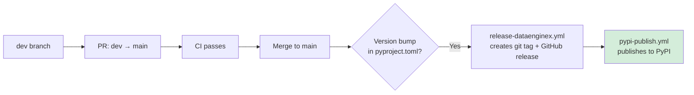

# Release Runbook

**Procedures for releasing DataEngineX to PyPI and rolling back.**

> **Quick Links:** [Release to PyPI](#release-to-pypi) · [Rollback](#rollback) · [Domain & Org Setup](#org--domain-rollout-github--cloudflare)

______________________________________________________________________

This runbook describes how to release `dataenginex` and roll back bad releases using the `dev` → `main` branch-based flow.

## Release Flow



## Pre-Release Checklist

- CI is green on `dev` branch.
- `CHANGELOG.md` is updated.
- Version in root `pyproject.toml` is bumped (semver).
- Tests pass locally: `uv run poe test`.
- Package builds cleanly: `uv build && twine check dist/*`.

## Release to PyPI

**Trigger**: Merge a PR from `dev` → `main` that contains a version bump in `pyproject.toml`.

```bash
# 1. Ensure dev is stable
gh pr checks <dev-pr-number>

# 2. Bump version in pyproject.toml (e.g., 0.6.0 → 0.7.0)
# Edit pyproject.toml: version = "0.7.0"

# 3. Commit version bump on dev
git add pyproject.toml CHANGELOG.md
git commit -m "chore: bump dataenginex to 0.7.0"
git push origin dev

# 4. Create promotion PR: dev → main
./scripts/promote.sh

# 5. Merge PR after CI passes
# release-dataenginex.yml automatically creates tag + GitHub release
# pypi-publish.yml automatically publishes to TestPyPI, then PyPI
```

**Verify**:

```bash
# Check release was created
gh release list

# Verify PyPI publication
pip install dataenginex==0.7.0 --dry-run

# Confirm package is importable
python -c "import dataenginex; print(dataenginex.__version__)"
```

## Rollback

### Yank a PyPI Release

PyPI does not support deletion, but a yanked release is skipped by `pip install` (unless explicitly requested):

```bash
# Via PyPI web UI: manage release → yank version
# Inform users via GitHub release notes
```

### Publish a Patch Release

```bash
# Fix the issue on dev
git checkout dev
# ... apply fix ...

# Bump to patch version (e.g., 0.7.1)
# Edit pyproject.toml: version = "0.7.1"

git add pyproject.toml
git commit -m "fix: <description of fix>"
git push origin dev

# Promote to main and release
./scripts/promote.sh
```

### Revert a Git Tag

If the GitHub release was created but PyPI publish has not yet run (or failed):

```bash
# Delete tag locally and remotely
git tag -d dataenginex-v0.7.0
git push origin :refs/tags/dataenginex-v0.7.0

# Delete the GitHub release
gh release delete dataenginex-v0.7.0 --yes
```

______________________________________________________________________

## Org + Domain Rollout (GitHub + Cloudflare)

Use this section for organization-level setup and domain cutover to `thedataenginex.org`.

### GitHub Organization Setup

1. Create/verify teams referenced in `CODEOWNERS`:
   - `infra-team`
   - `backend-team`
   - `data-team`
1. Ensure each team has appropriate repo permissions.
1. Enable branch/ruleset protections for `main` and `dev`:
   - Require pull request reviews
   - Require status checks to pass before merge
   - Enforce CODEOWNERS review where needed
1. Enable Discussions for `TheDataEngineX/DEX`.
1. Create at least one organization Project and define fields (status, priority, milestone).
1. Configure project automation inputs:
   - Variable `ORG_PROJECT_URL` = full URL of the org project
   - Secret `ORG_PROJECT_TOKEN` = PAT with project write access

### GitHub Pages Setup (Docs)

Repository includes `.github/workflows/docs-pages.yml`.

1. In repo settings, enable **Pages** and select **GitHub Actions** as source.
1. Confirm `github-pages` environment is available.
1. Trigger workflow manually once (`Docs Pages Deploy`) to bootstrap deployment.
1. Verify `site/CNAME` in artifact contains `docs.thedataenginex.org`.

### Cloudflare DNS Setup

Configure DNS records for `thedataenginex.org`:

- `docs.thedataenginex.org` → CNAME to `<org-or-user>.github.io`
- `api.thedataenginex.org` → ingress/load balancer endpoint
- Apex `thedataenginex.org`:
  - CNAME flattening to chosen site host, or
  - A/AAAA to website host

### TLS / SSL

1. Set Cloudflare SSL mode compatible with origin (recommended: Full / Full strict).
1. Verify HTTPS for:
   - `https://docs.thedataenginex.org`
   - `https://api.thedataenginex.org`

### Fast 10–15 Minute Execution Checklist

1. Pages source = GitHub Actions.
1. Set `ORG_PROJECT_URL` + `ORG_PROJECT_TOKEN`.
1. Configure Cloudflare DNS (`docs`, `api`, apex).
1. Trigger workflows manually:
   - `Docs Pages Deploy`
   - `Label Sync`
   - `Project Automation`
1. Smoke checks:
   - Docs URL resolves with HTTPS
   - Test issue + PR auto-added to project
   - Labels from `.github/labels.yml` are present

### Exact Post-Merge Verification Order

1. Merge PR.
1. Wait for `Docs Pages Deploy` success.
1. Validate `https://docs.thedataenginex.org`.
1. Trigger `Label Sync` once and inspect labels.
1. Open temporary test issue/PR and confirm project automation.
1. Validate `https://api.thedataenginex.org` TLS/hostname routing.
1. Send controlled warning alert and verify `.org` sender/recipient behavior.

### Rollback for Domain Cutover

1. Revert Cloudflare DNS records to previous targets.
1. Set DNS-only mode temporarily for diagnostics if needed.
1. Re-run Pages deploy once DNS stabilizes.

______________________________________________________________________

## Related Documentation

**Deployment:**

- **[CI/CD Pipeline](CI_CD.md)** - Complete automation guide

**Operations:**

- **[Observability](OBSERVABILITY.md)** - Monitor applications built on DEX
- **[SDLC](SDLC.md)** - Development lifecycle

______________________________________________________________________

**[← Back to Documentation Hub](docs-hub.md)**
